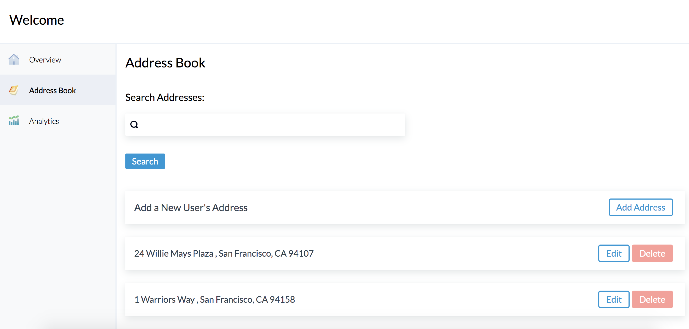
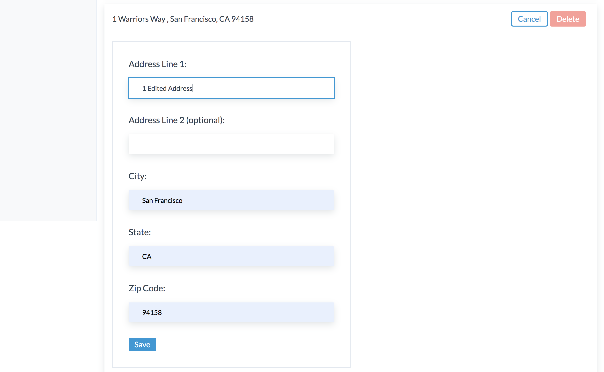

# Address-Book-WebApp
This web app provides users with a friendly way to search their address books and manage the addresses in them.

A partially built front-end was provided to begin with, along with an address controller complete with CRUD & a full-text search.  This controller uses a redis instance as the database.

I designed and built the address manager API and then built the front end to use the API. The front-end is built with `next.js` and it's using `Tailwind CSS` as it's utility library.

# Getting Started
## Example



## Pre-reqs
You must have docker and docker-compose running on your system, which you can get [here](https://www.docker.com/products/docker-desktop) for windows & mac.

## To run
```sh
docker-compose up
```

Your changes will automatically reflect in both the server and the client.

You can find your client at
http://localhost:3000
and your server at
http://localhost:3001

## To run the server tests
```sh
docker-compose run --rm server npx mocha
```

## To work inside the container
First start the servers with
```sh
docker-compose up
```

then in a new terminal

```sh
docker-compose exec <server | client> /bin/bash
# eg
docker-compose exec server /bin/bash
docker-compose exec client /bin/bash
```
